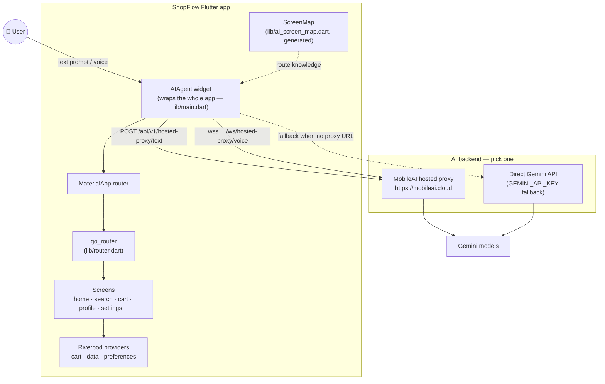
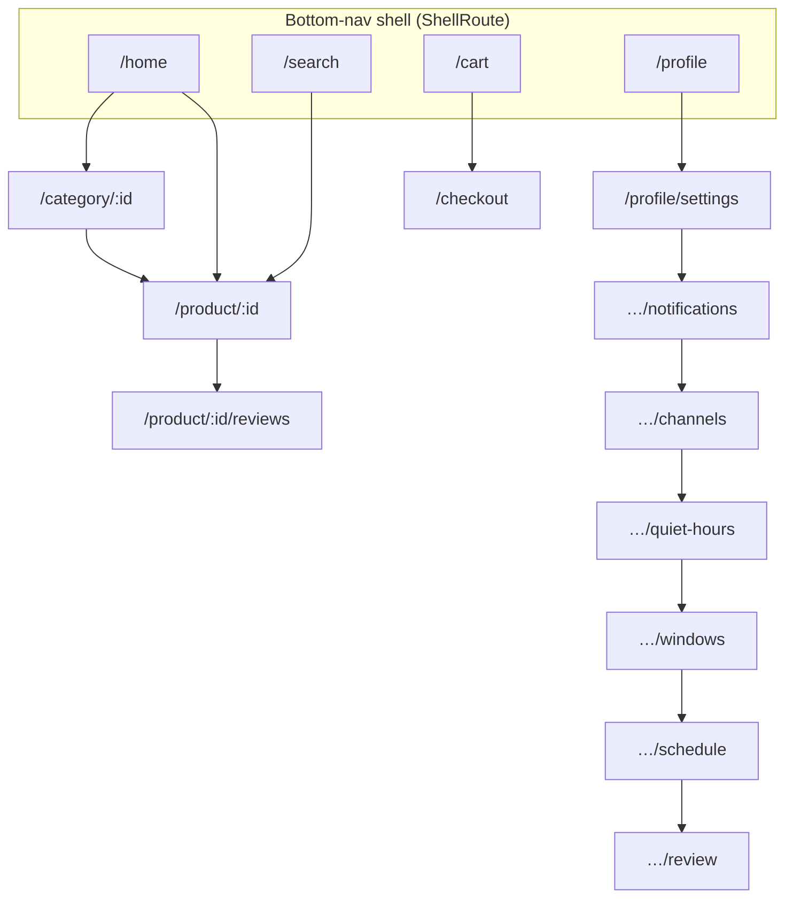
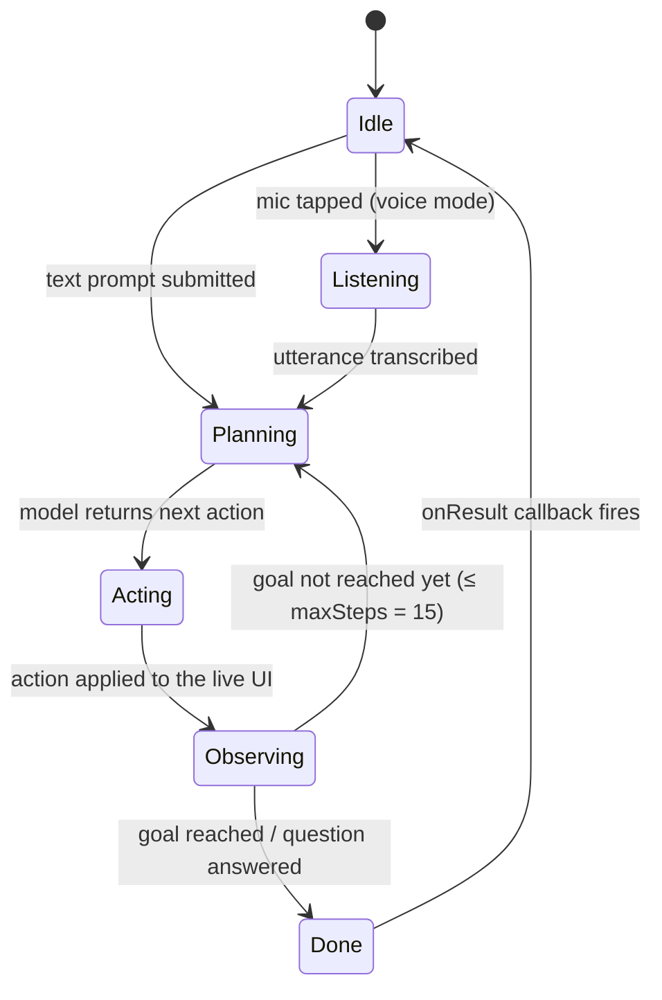
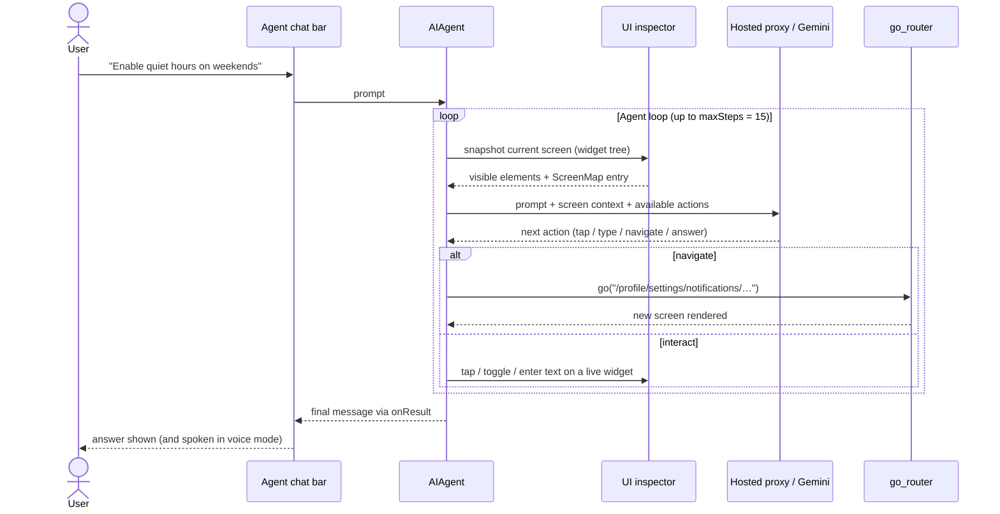
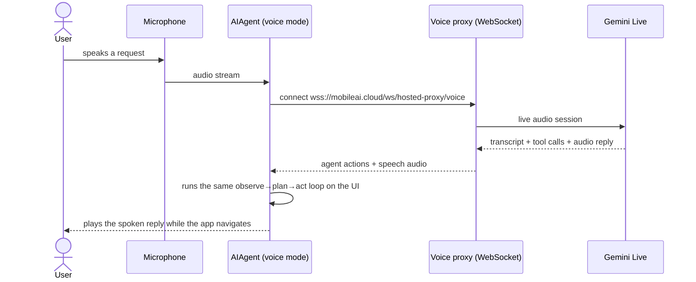
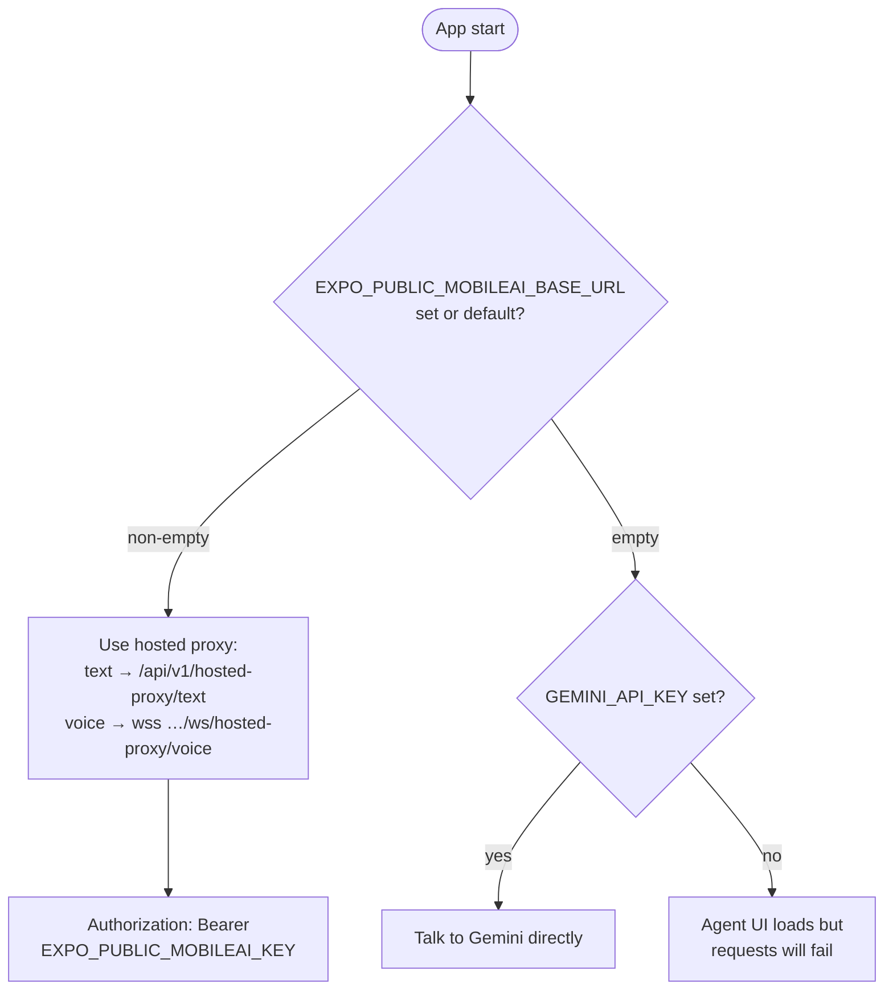

# ShopFlow — `mobileai_flutter` demo

A complete, runnable Flutter app that showcases the
[`mobileai_flutter`](https://pub.dev/packages/mobileai_flutter) SDK in action:
an **in-app, UI-aware AI agent** (text **and** voice) that can read the live
widget tree, answer questions, and drive **multi-step navigation** across a
realistic e‑commerce app called *ShopFlow*.

> This repo is a self-contained copy of the package's official `example/` app,
> wired to depend on the published `mobileai_flutter` package from pub.dev so you
> can clone and run it directly.

---

## What it demonstrates

- **`AIAgent` widget** wrapping a `MaterialApp.router`, giving the agent control
  over the whole app.
- **Screen-aware navigation** via a generated `ScreenMap` (`lib/ai_screen_map.dart`)
  that tells the agent which routes exist, what each screen contains, and which
  transitions are safe.
- **Text + voice** modes (`enableVoice: true`) backed by either:
  - the **MobileAI hosted proxy** (`https://mobileai.cloud`, default), or
  - a **direct Gemini** key (`GEMINI_API_KEY`) as a local fallback.
- **Autopilot mode** — the agent taps, types, and navigates with no approval
  prompts (see [How the AI takes over the UI](#how-the-ai-takes-over-the-ui)).
- **"Liquid glass" agent UI** — the chat bar is restyled with a translucent,
  backdrop-blurred (Apple Glass-style) look, and in voice mode the floating
  button becomes an animated orb that breathes while listening and pulses while
  the AI speaks (patched in the vendored `third_party/mobileai_flutter`).
- **Telemetry** through `TelemetryConfig` keyed by the MobileAI publishable key.
- A deep, multi-level settings flow (Profile → Settings → Notifications →
  Channels → Quiet Hours → Windows → Schedule → Review) so you can watch the
  agent chain navigation steps to complete a task end-to-end.

## Architecture at a glance



The `AIAgent` sits **above** the router, so every screen the app renders is
inside the agent's reach: it can inspect what's on screen, interact with the
widgets, and push new routes — the same way a user would, just programmatically.

## Project layout

```
lib/
  main.dart                 # App entry; configures the AIAgent widget
  router.dart               # go_router config (routes + bottom nav shell)
  ai_screen_map.dart        # GENERATED screen map consumed by the agent
  data/seed_data.dart       # In-memory product/category/review seed data
  providers/                # Riverpod providers (cart, data, preferences)
  screens/                  # All app screens (home, search, cart, profile, ...)
integration_test/           # Voice approval / complex-flow e2e tests
```

`ai_screen_map.dart` is generated by the package's
`dart run tool/generate_screen_map.dart` tool and committed here so the demo runs
without a generation step. Re-generate it if you change `router.dart`.

### Route graph the agent navigates



The long Profile → … → Review chain exists on purpose: ask the agent something
like *"turn on quiet hours for weekends"* and watch it chain seven navigation
steps, flipping switches along the way.

---

## How the AI takes over the UI

Three settings in `lib/main.dart` hand the agent the keys:

| Setting | Value | Effect |
| ------- | ----- | ------ |
| `interactionMode` | `AppInteractionMode.autopilot` | Skips the workflow-approval gate — no "Allow / Don't Allow" prompts |
| `actionSafety` | `ActionSafetyConfig(enabled: false)` | Turns off the per-action safety classifier |
| `screenMap` | `shopFlowScreenMap` | Gives the agent a map of every route, its contents, and safe transitions |

On each step the agent **observes** the live widget tree (what's actually
rendered, not a hardcoded script), **plans** with the model, and **acts** on
real widgets — tapping buttons, entering text, toggling switches, and pushing
`go_router` routes:



### Text request, step by step



### Voice session



> ⚠️ Autopilot + disabled action safety is a **demo configuration**. In a real
> app you'd keep approvals on for destructive flows (checkout, deletions) and
> let the safety classifier gate individual actions.

---

## Prerequisites

| Tool    | Version                                  |
| ------- | ---------------------------------------- |
| Flutter | **≥ 3.24.0** (developed against 3.44.1)  |
| Dart    | **≥ 3.11.4** (bundled with the above)    |

Check with `flutter --version` and `flutter doctor`.

### Configuration (keys & endpoints)

The app reads three compile-time values via `String.fromEnvironment` (Dart
defines). All are optional — sensible defaults are baked in:

| Define                           | Default                       | Purpose                                              |
| -------------------------------- | ----------------------------- | ---------------------------------------------------- |
| `EXPO_PUBLIC_MOBILEAI_BASE_URL`  | `https://mobileai.cloud`      | Base URL for the hosted text/voice proxy + telemetry |
| `EXPO_PUBLIC_MOBILEAI_KEY`       | a demo `mobileai_pub_…` key   | MobileAI publishable key (`Authorization: Bearer`)   |
| `GEMINI_API_KEY`                 | _(empty)_                     | Direct Gemini key; used only if no proxy is set      |
| `EXPO_PUBLIC_MOBILEAI_VOICE`     | `Aoede`                       | Gemini Live prebuilt voice; pins it so it doesn't drift between male/female across reconnects (see `.env.example` for the voice list + preview links) |

> The defaults point at the public MobileAI cloud with a **publishable** key, so
> the demo works out of the box. To use your own backend or Gemini key, override
> them (below). The `EXPO_PUBLIC_*` names mirror the React Native sibling app.

Pass defines on the command line:

```bash
flutter run \
  --dart-define=EXPO_PUBLIC_MOBILEAI_KEY=your_mobileai_key \
  --dart-define=GEMINI_API_KEY=your_gemini_key
```

…or put them in a file and use `--dart-define-from-file`:

```bash
cp .env.example .env        # then edit values
flutter run --dart-define-from-file=.env
```

`.env` is git-ignored.

### How the configuration resolves at startup



---

## Quick start

```bash
git clone https://github.com/rtodea/mobileai-flutter-shopflow-demo.git
cd mobileai-flutter-shopflow-demo
flutter pub get
flutter run            # pick a device, or use -d chrome / -d windows / -d macos
```

---

## Running on Windows

All commands below are PowerShell, run from the repo root after
`flutter pub get`.

### Windows desktop

Requires Visual Studio Build Tools with the **"Desktop development with C++"**
workload (the vendored `flutter_sound` patch makes the build work out of the
box — see Troubleshooting).

```powershell
flutter run -d windows
```

### Android emulator

```powershell
# 1. See what's installed (emulators are created in Android Studio
#    via Tools → Device Manager, or with avdmanager)
flutter emulators

# 2. Launch one by id, e.g.:
flutter emulators --launch Pixel_8_API_35

# 3. Wait for it to boot, confirm Flutter sees it…
flutter devices          # shows something like "emulator-5554"

# 4. …and run:
flutter run -d emulator-5554
```

If no emulator exists yet, create one from the command line (requires the
Android SDK command-line tools):

```powershell
sdkmanager "system-images;android-35;google_apis;x86_64"
avdmanager create avd -n Pixel_8_API_35 -k "system-images;android-35;google_apis;x86_64" -d pixel_8
```

> 🎤 **Voice on the emulator:** in the emulator's Extended Controls
> (`…` button) → **Microphone**, enable *"Virtual microphone uses host audio
> input"*, otherwise the agent hears silence.

### Physical Android device (USB)

1. On the phone: **Settings → About phone → tap "Build number" 7×** to unlock
   Developer options, then enable **Developer options → USB debugging**.
2. Connect via USB and accept the *"Allow USB debugging?"* prompt on the phone.
3. Verify and run:

```powershell
adb devices              # device should be listed as "device", not "unauthorized"
flutter devices          # shows the phone with its device id
flutter run -d <device-id>     # e.g. flutter run -d R5CT12ABCDE
```

If `adb devices` shows nothing, install your vendor's USB driver (Google USB
Driver via Android Studio's SDK Manager works for Pixels) and run
`adb kill-server; adb start-server`.

### Physical Android device (Wi‑Fi, Android 11+)

```powershell
# On the phone: Developer options → Wireless debugging → Pair device with pairing code
adb pair <phone-ip>:<pairing-port>     # enter the 6-digit code when prompted
adb connect <phone-ip>:<connect-port>  # the port shown on the main Wireless debugging screen
flutter devices
flutter run -d <phone-ip>:<connect-port>
```

### Web (also handy on Windows)

```powershell
flutter run -d chrome
```

---

## Platform setup

The app targets Android, iOS, web, Windows, macOS, and Linux. Install the
Flutter SDK once, then enable the targets you care about. Run `flutter doctor`
after install and follow whatever it flags.

### macOS

```bash
# Option A: Homebrew
brew install --cask flutter

# Option B: official zip
#   https://docs.flutter.dev/get-started/install/macos
```

- **iOS:** install Xcode + command line tools, then `sudo gem install cocoapods`
  (or `brew install cocoapods`). Run on a simulator: `flutter run -d iphone`.
- **macOS desktop:** `flutter run -d macos`.
- **Web:** `flutter run -d chrome`.
- Apple Silicon: also install Rosetta if a tool asks for it
  (`sudo softwareupdate --install-rosetta --agree-to-license`).

### Windows

```powershell
# Option A: Chocolatey
choco install flutter

# Option B: official zip (what this repo was built with) — no admin needed
#   1. Download https://docs.flutter.dev/get-started/install/windows
#   2. Extract to C:\src\flutter
#   3. Add C:\src\flutter\bin to your PATH
```

- **Web:** `flutter run -d chrome` (Chrome required).
- **Windows desktop:** install "Desktop development with C++" via Visual Studio
  Build Tools, then `flutter run -d windows`. (The Windows build needs a patched
  `flutter_sound`; this repo vendors it under `third_party/flutter_sound`, so it
  builds with no extra steps — see Troubleshooting.)
- **Android:** install Android Studio + SDK, accept licenses
  (`flutter doctor --android-licenses`), then follow
  [Running on Windows](#running-on-windows) above for emulator / device commands.

### Linux / ARM (incl. ARM64 / Raspberry Pi-class & Apple-Silicon Linux VMs)

```bash
# Option A: snap (x64)
sudo snap install flutter --classic

# Option B (recommended on ARM64, where prebuilt zips aren't published):
#   git clone the SDK — it bootstraps the right Dart/engine artifacts on first run
git clone https://github.com/flutter/flutter.git -b stable ~/flutter
export PATH="$HOME/flutter/bin:$PATH"   # add to ~/.bashrc / ~/.zshrc
flutter --version                       # triggers first-run artifact download
```

Desktop (GTK) build dependencies on Debian/Ubuntu:

```bash
sudo apt-get update
sudo apt-get install -y clang cmake ninja-build pkg-config \
  libgtk-3-dev liblzma-dev libstdc++-12-dev
```

- **Linux desktop:** `flutter run -d linux`.
- **Web:** install Chrome/Chromium, then `flutter run -d chrome`
  (set `CHROME_EXECUTABLE` if it isn't auto-detected).
- **Android:** install Android Studio (ARM64 builds are available) and run on a
  device/emulator.

> **ARM64 note:** Flutter supports Linux/arm64 as a host via the git-clone install
> above; the snap and the prebuilt `.tar.xz`/`.zip` archives are x64-only. On
> Apple Silicon, prefer the macOS instructions instead of a Linux VM.

---

## Voice support

Voice (`enableVoice: true`) records microphone audio and streams it to the voice
proxy. Permissions are pre-configured in this repo:

- **Android** — `RECORD_AUDIO` in `android/app/src/main/AndroidManifest.xml`.
- **iOS** — `NSMicrophoneUsageDescription` in `ios/Runner/Info.plist`.
- **macOS** — `NSMicrophoneUsageDescription` in `Info.plist` **and** the
  `com.apple.security.device.audio-input` + network-client entitlements.
- **Web** — the browser prompts for mic access on first use (HTTPS or localhost).

To run text-only, set `enableVoice: false` in `lib/main.dart`.

---

## Common commands

```bash
flutter pub get          # fetch dependencies
flutter analyze          # static analysis (should be clean)
flutter test             # unit/widget tests
flutter run -d chrome    # run on web
flutter build web        # release web build into build/web
flutter build apk        # Android
flutter build macos      # macOS desktop
```

---

## How the AI integration is wired (in `lib/main.dart`)

1. Resolve the base URL → derive the **text** proxy
   (`/api/v1/hosted-proxy/text`) and **voice** proxy
   (`wss://…/ws/hosted-proxy/voice`).
2. If no proxy is configured but `GEMINI_API_KEY` is present, fall back to
   talking to Gemini directly.
3. Build the `AIAgent` with the `router`, the `screenMap`, telemetry, voice
   settings, autopilot interaction mode, and an `onResult` callback that logs
   the agent's final message.
4. Render the normal `MaterialApp.router` as the agent's `child`.

See the package docs for the full API:
<https://pub.dev/packages/mobileai_flutter>.

---

## Where the agent's prompt lives

The system prompt the model sees is assembled in two layers by
`third_party/mobileai_flutter/lib/src/core/system_prompt.dart`:

1. **App-level instructions — edit these.** `lib/main.dart` passes
   `instructions:` to the `AIAgent`. That string is wrapped in
   `<app_instructions>…</app_instructions>` and appended to **every** prompt
   (text *and* voice), so it's the right place for ShopFlow-specific persona,
   tone, and do/don't rules:

   ```dart
   instructions: 'You are a helpful assistant for ShopFlow, an e-commerce app.',
   ```

2. **SDK base prompt — the bulk of the behavior.** The core agent persona and
   rules live in the **generated** bundle
   `third_party/mobileai_flutter/lib/src/core/rn_prompt_bundle.g.dart`
   (generated upstream from `react-native-ai-agent/src/core/systemPrompt.ts`),
   keyed by mode / language / support style. `system_prompt.dart` selects the
   right one — `buildSystemPrompt` for text, `buildVoiceSystemPrompt` for voice
   — then layers on a `<runtime_behavior>` block and, for voice, a
   `<voice_language_guard>` block.

For most tuning, change the `instructions:` string in `lib/main.dart`. Deeper
changes mean editing the vendored `.g.dart` (and re-applying if the SDK is
bumped — see the vendored-package note in `CLAUDE.md`).

The **voice** the agent speaks with is separate from the prompt — set it via
`EXPO_PUBLIC_MOBILEAI_VOICE` (see the config table above).

---

## Troubleshooting

### "Model is not available, due to high demand" / overloaded
Gemini is returning **HTTP 503 (model overloaded)** — a transient, server-side
capacity issue, common on the free tier and on preview / native-audio (voice)
models. Your key and model are fine; the request just got throttled.
- Retry — it's intermittent.
- Switch to a steadier text model, e.g. pass `model: 'gemini-2.0-flash'` (or
  `gemini-flash-latest`) to `AIAgent` in `lib/main.dart`.
- The free tier has low rate limits (~10 req/min); enable billing for higher
  limits.
- For dependable voice, prefer the **hosted MobileAI proxy** over direct Gemini
  (set `EXPO_PUBLIC_MOBILEAI_BASE_URL` + a real `EXPO_PUBLIC_MOBILEAI_KEY`).

### "Microphone not available / unavailable" (desktop)
Having mic *privacy* enabled isn't enough — the recorder opens your **default
input device**. If a stale/disconnected Bluetooth "Hands-Free" mic is the
default, recording fails.
- Settings → System → Sound → Input → select a real mic (e.g. your laptop mic
  array), not a Bluetooth hands-free profile.
- Sound Control Panel → Recording → set it as **Default Device** *and* **Default
  Communications Device**; disable disconnected Bluetooth entries.
- Verify Settings → Privacy & security → Microphone → access + "let desktop apps
  access your microphone" are **On**.
- Voice also needs the live WebSocket to connect; if the voice model is
  overloaded you'll still see the model error above even with a working mic.

### Windows build: `No target "flutter_sound_plugin"`
`flutter_sound` 9.30.0 ships a broken Windows plugin (its native code is named
`taudio`, but its pubspec declares `pluginClass: FlutterSoundPluginCApi`), so
Flutter's generated registrant can't find the expected target/symbol/header.
This repo includes a **patched copy under `third_party/flutter_sound`** wired via
`dependency_overrides` in `pubspec.yaml`, so `flutter build windows` works out of
the box. If you bump `flutter_sound`, re-apply or drop that patch.

## License

MIT — see [LICENSE](LICENSE). The `mobileai_flutter` package is MIT-licensed by
its authors; this repo adapts that package's example app. The vendored
`third_party/flutter_sound` is a patched copy of the MIT-licensed `flutter_sound`
package (see its own LICENSE).
